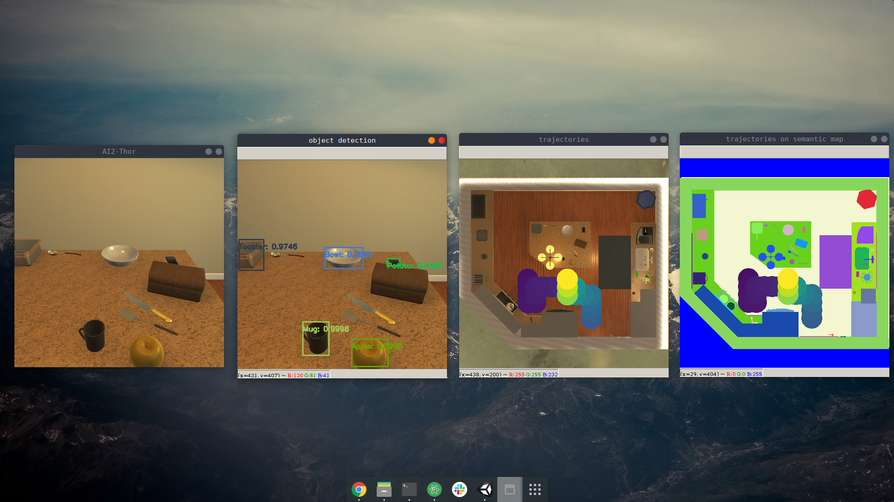

## Robot (INT3409 Spring 2019) Course project

### Team member
* Vũ Minh Hiếu
* Phí Hoàng Linh
* Phạm Tuấn Dũng

### Preview (challenge 1 + 2)

From left to right: original frame, object detection, trajectories on topview, trajectories on semantic topview

